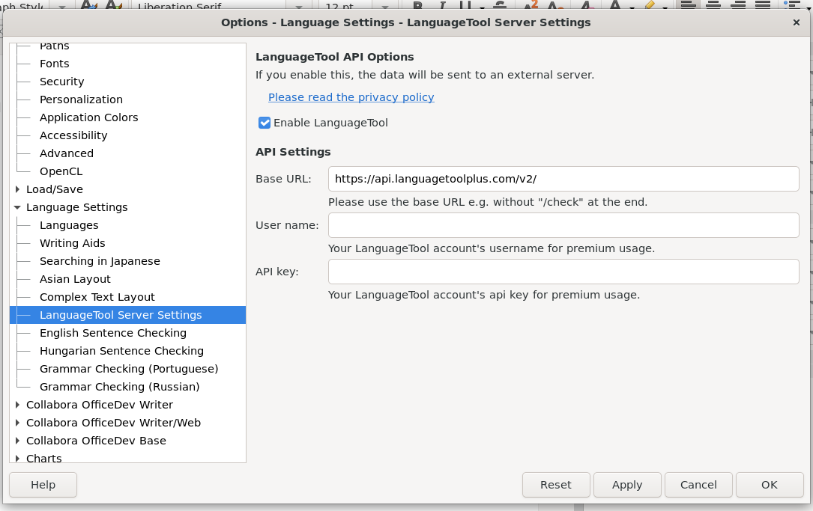
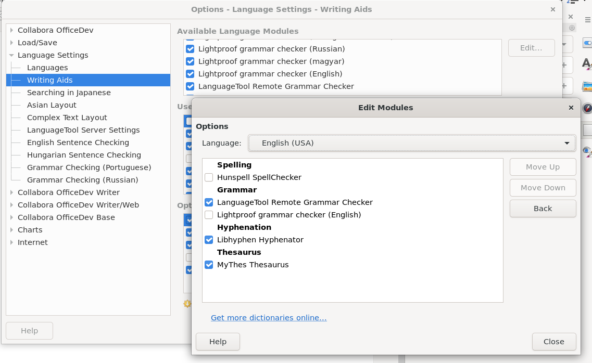

A new LanguageTool Server Settings group is available in Options -> Language Settings dialog. Base URL, username and API key can be set here.

Lastly a new Writing Aid by the name of LanguageTool Remote Grammar Checker should be switched on.

