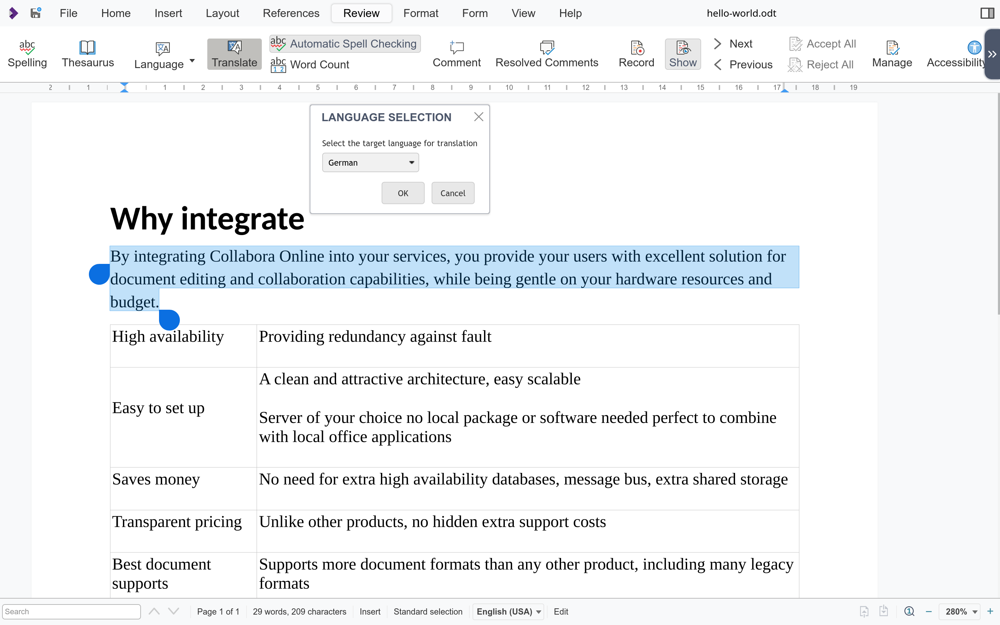

New in version 22.05.7.3.

DeepL is supported by Collabora Online.

Add your DeepL API URL within `api_url` and your DeepL API key within `auth_key` tags in your configuration (`coolwsd.xml`) to use DeepL’s translation capabilities in Collabora Online. For example the selected paragraph can be translated from any supported source language to any supported target language with the Translate button on the Review bar.

 

You can find the respective option within your `coolwsd.xml` where you can set the DeepL API settings you need within the `deepl` block.

To turn it on, set `enabled` property to true. The API URL may be for example `https://api-free.deepl.com/v2/translate`, with the free plan. Note that the text content of the document will be sent to the cloud API. Please read DeepL’s privacy policy: [https://www.deepl.com/en/privacy](https://www.deepl.com/en/privacy) .

deepl block of coolwsd.xml

```
 <deepl desc="DeepL API settings for translation service">
     <enabled desc="If true, shows translate option as a menu entry in the compact view and as an icon in the tabbed view." type="bool" default="false">true</enabled>
     <api_url desc="URL for the API" type="string" default="">https://api-free.deepl.com/v2/translate</api_url>
     <auth_key desc="Auth Key generated by your account" type="string" default=""></auth_key>
 </deepl>
```
