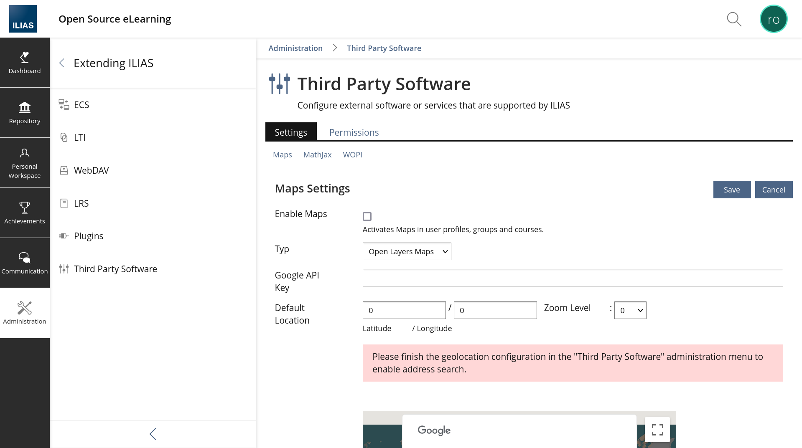
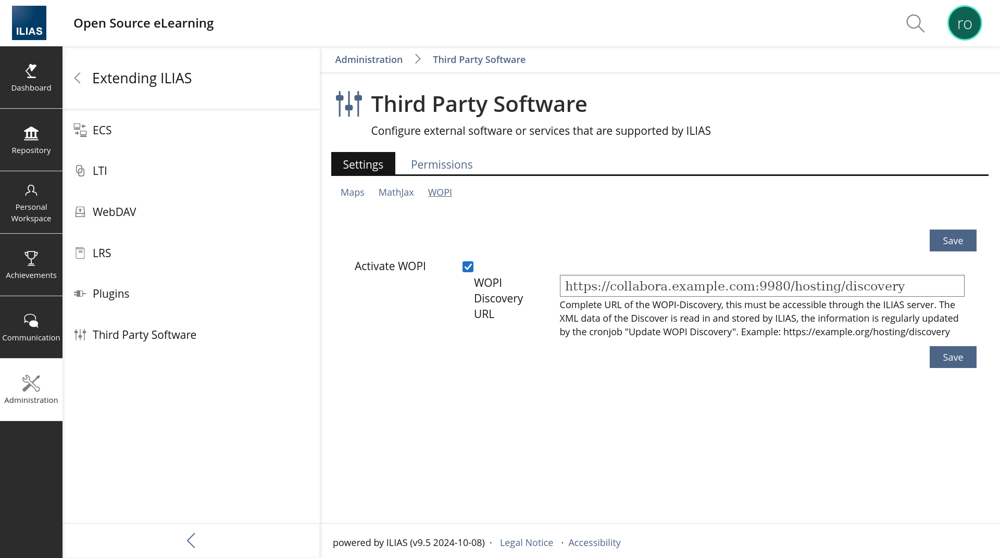

As the administrator of your ILIAS system, go to the Administration section, Third Party Software.

There, in the Settings tab, select WOPI, click Activate WOPI and enter the WOPI discovery URL for Collabora Online.

There is is the only setting option you can set:

| Setting | Description |
| --- | --- |
| WOPI Discovery URL | The discovery URL of the WOPI Collabora Online. It is the URL of the Collabora Online server plus the path /hosting/discovery. For example: https://cool.example.com:9980/hosting/discovery |
