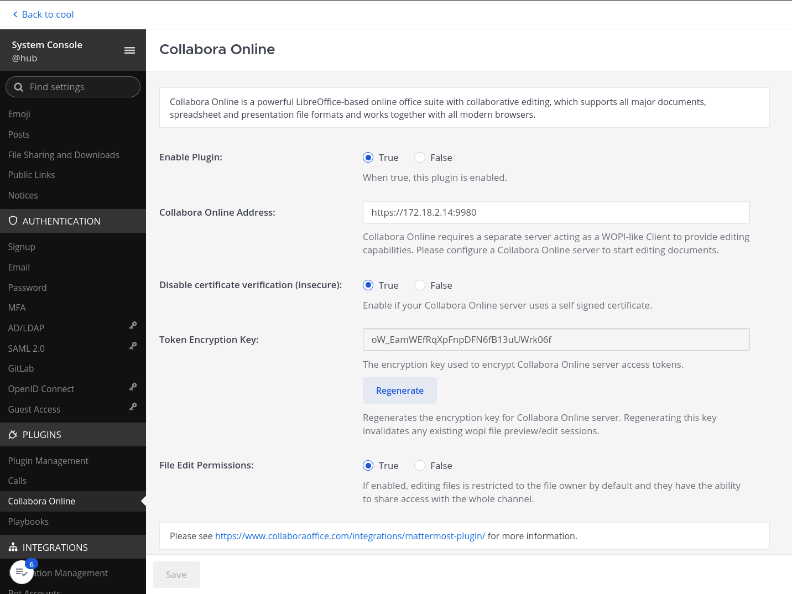

In your Mattermost system as an adminstrator, go to the System Console, and display the Plugin Management page to upload the plugin. Once done, make sure it is listed and enabled. The Collabora Online page should be listed just below on the sidebar.

