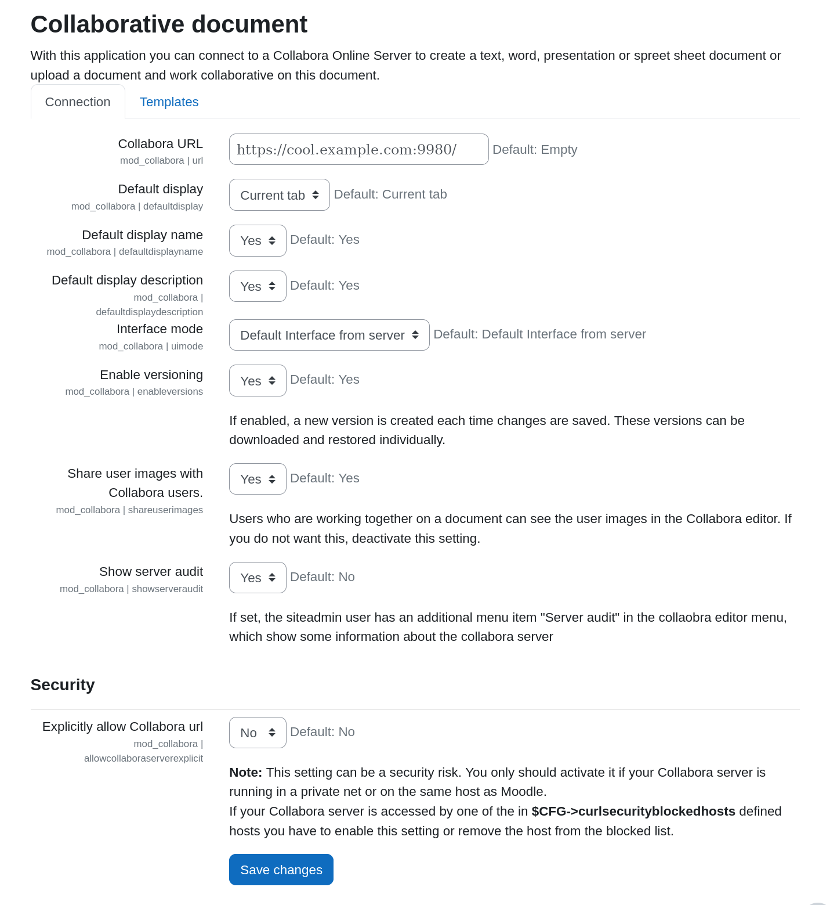
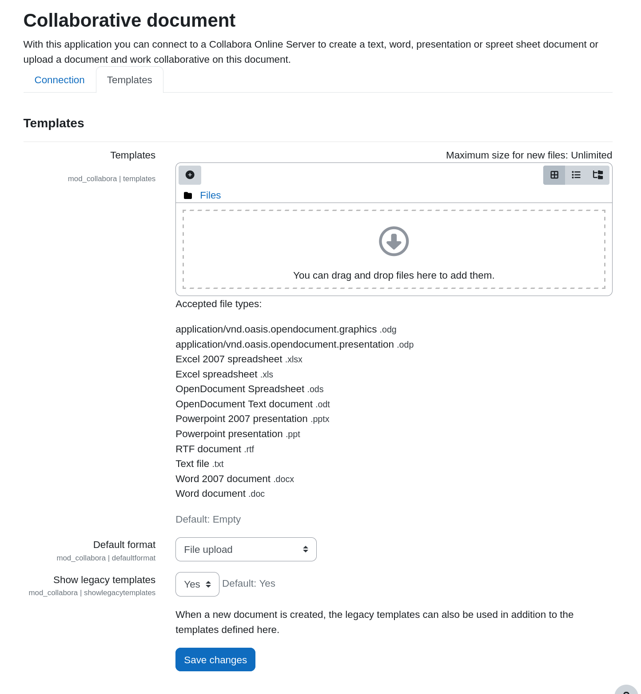

This documentation is based on Moodle 4.5.

Log into Moodle as a site adminstrator. Go to Site Administration then Plugins and select Collaborative document.

### Main configuration

The page for the main configuration of the plugin looks like this:

It presents the following options:

| Setting | Description |
| --- | --- |
| Collabora URL | The URL of the Collabora Online server. There is no default and must be set. |
| Default Display | How to display the Collabora Online frame: Current tab (default) New tab |
| Default display name | Whether to display the document name by default when creating an activity. (default: Yes) |
| Default display description | Whether to display the document description by default when creating an activity. (default: Yes) |
| Interface mode | The default UI mode: tabbed, compact or server default (default). |
| Enable versioning | Whether Moodle should preserve the older versions of a document (default: Yes). |
| Share user images with Collabora users | Whether user avatars shall be used in Collabora Online sessions. This provides more privacy when disabled. (default: Yes) |
| Show server audit | Whether the server audit button and other admin only features are enabled for the Moodle site administrators. (default: No) |
| Explicitly allow Collabora url | As a security feature, Moodle blocks certain addresses from being used for HTTP connections. If needed you can explicitly allow the Collabora Online server address based on the Collabora URL. (default: No) If the server is on a public address, it can usually be left alone. Otherwise it can also be addressed by changing the list in Site Administration > General > HTTP Security |

### Templates

You can setup templates used to create new documents.

| Setting | Description |
| --- | --- |
| Templates | Files to be used as templates. Select and upload documents. |
| Default Format | Set the default format for templates: File upload Specify text |
| Show legacy templates | Whether legacy templates can be used. |
