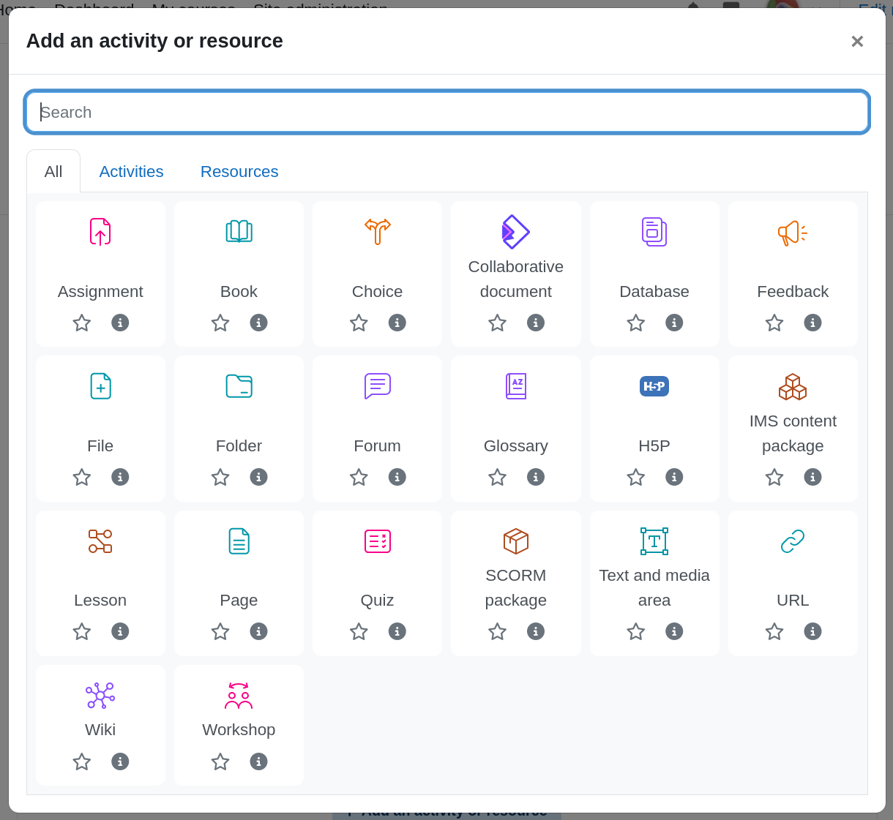
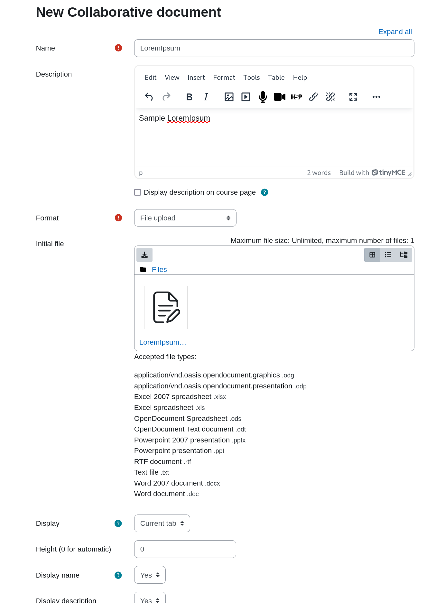
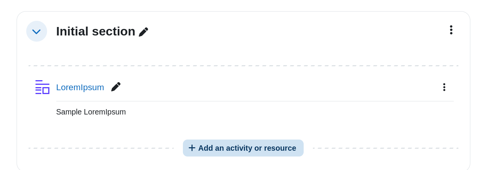
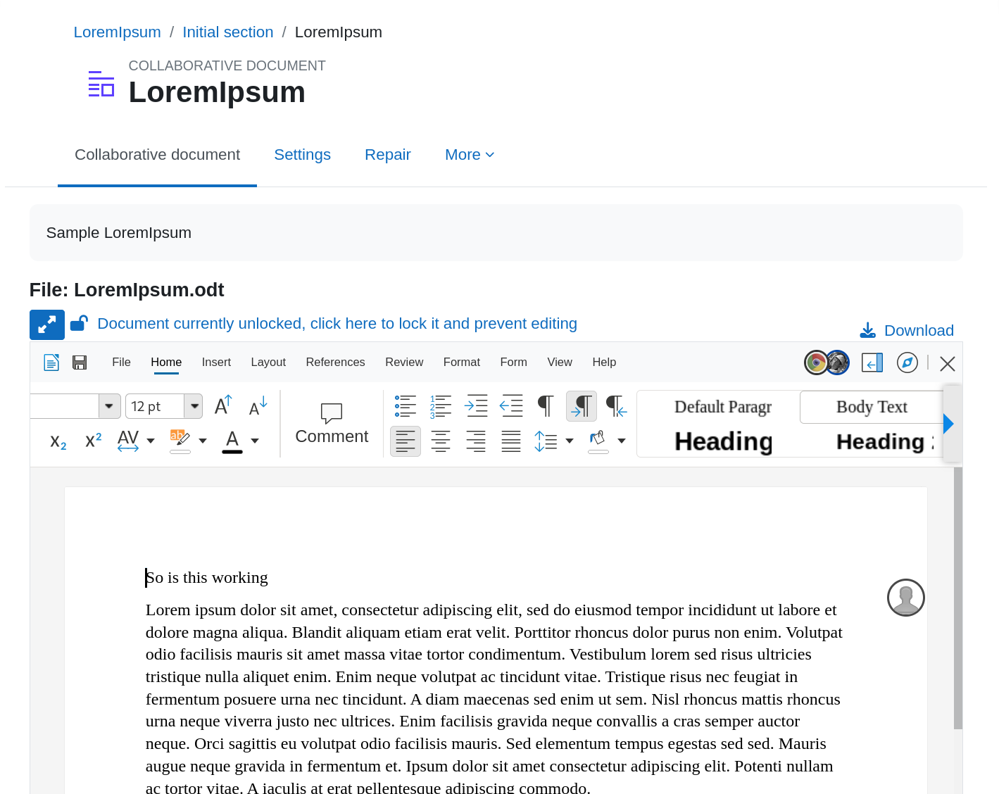

Collaborative documents can be added to courses. In a course, switch to edit mode, and add an activity where appropriate. Select Collaborative document.

Once done you’ll be presented a form to edit the activity.

You can set the following options:

| Setting | Description |
| --- | --- |
| Name | The name of the document. Mandatory. |
| Description | The description of the document. And whether you want it displayed or not on the course page. |
| Format | The format of the document: File upload: the format will be of the file uploaded. Specified text: the format will be a Writer document with the specified text content. Legacy templates: use one of the legacy templates for the specified document type. |
| Initial file | For the File upload format, upload an initial file to set the content. |
| Specified text | For the Specified text format, input the text. |
| Display | How to display the Collabora Online frame: Current tab (default) New tab |
| Height | Height if the frame if display is Current tab. 0 mean it is automatic. |
| Display name | Whether to display the document name, if display is Current tab. |
| Display description | Whether to display the document description, if display is Current tab. |

Once you click Save and return to course, you can view the course.

> 

You can view the document:

> 

This is how you add collaborative document editing to your Moodle course.
