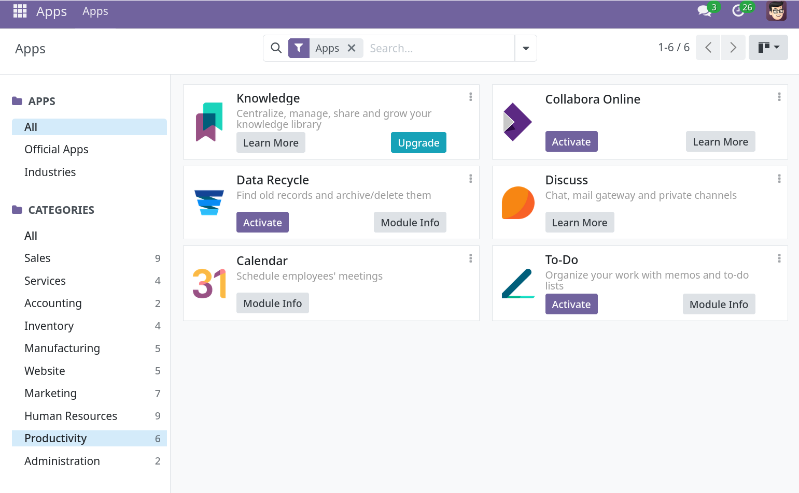

Download the archive from the [Odoo app store](https://apps.odoo.com/apps/modules/19.0/collabora_odoo) [https://apps.odoo.com/apps/modules/19.0/collabora_odoo],

Important

Currently only Odoo version 17, 18 and 19 are supported. Each version needs a separate version of the module. The Odoo app store offers you to select a different version but default to 19.

Copy the content of the downloaded archive into the addons directory on the Odoo server. Make sure the file `__manifest__.py` is directly in the `collabora_odoo` directory (this should be the default when extracting the archive).

Refresh the list of apps. Then locate the Collabora Online app in the list. Clicking on Productivity can help here to find it.

Click Activate.

Then you need to configure it. Go to the settings, there will be a Collabora Online entry for the configuration of the plugin.
