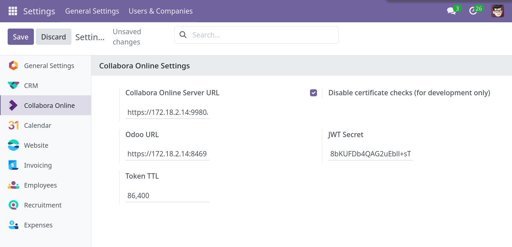

These are the options you can set:

| Setting | Description |
| --- | --- |
| Collabora Online Server URL | The URL of the Collabora Online server. |
| Odoo URL | The URL of the Odoo server. |
| Disable certificate verification (insecure) | Disable the TLS certificate verification when connecting to the Collabora Online server. Caution Should only be “checked” for development, if you don’t have valid certificates. |
| JWT Secret | This secret is used to generate the token to access the documents. |
| Token TTL | How long the token is valid, in seconds. Default is 86,400 seconds (24 hours). |
