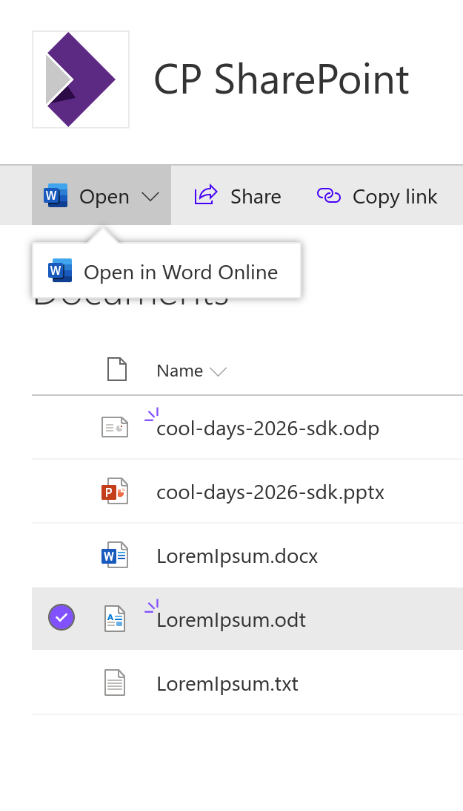

To test, just try to open the document in SharePoint. It will say Open With Word Online (or the equivalent for other types of documents) even if you have configured with Collabora Online.

 

SharePoint Subscription Edition open action
