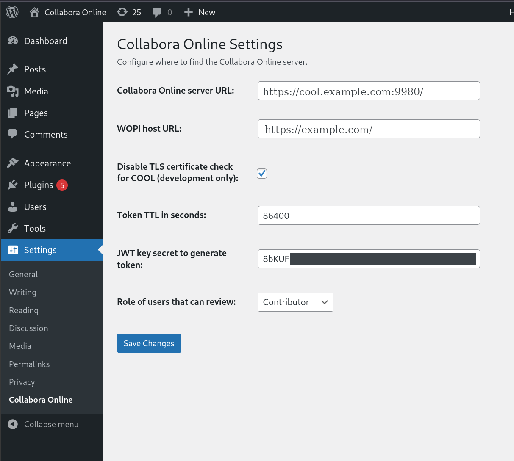

Log into WordPress™ as an administrator. Go to the dashboard, then Settings and select Collabora Online.

You can set the following options:

| Setting | Description |
| --- | --- |
| Collabora Online server URL | The URL of the Collabora Online server. There is no default and must be set. |
| WOPI host URL | The URL of the WOPI host: it’s the WordPress address. |
| Disable TLS certificate check for COOL | Disable the TLS certificate verification when connecting to the Collabora Online server. Caution Should only be “checked” for development, if you don’t have valid certificates. |
| Token TTL in seconds | How long the document editing session is valid in seconds. (default: 86400, 24 hours) |
| JWT key secret | This secret is used to generate the token to access the documents. You can generate a secret using the following command line: head -c 64 /dev/urandom \| base64 -w 0. |
| Role of users that can review | This define which is the minimum user role to review a document (i.e. be able to add comments). (default: contributor) |

### Extra configuration

For the integration to work, it is important that WordPress™ be able to handle the WOPI URL. The requirement is that WordPress™ uses a permalink structure that is is not the default Plain.

Chances that this is already the case, but you should make sure it is. Got to the dashboard, then Settings and select Permalinks. For Permalink structure, any choice but Plain will work. Make sure the .htaccess rules are set properly as instructed. See [WordPress documentation](https://wordpress.org/documentation/article/customize-permalinks/) [https://wordpress.org/documentation/article/customize-permalinks/] if you need more help.
