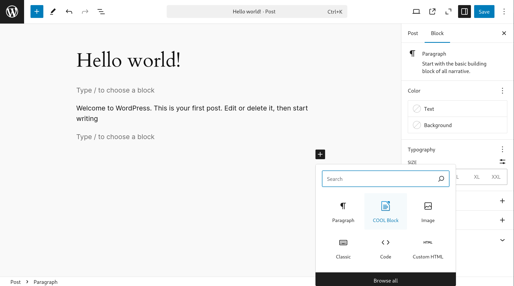
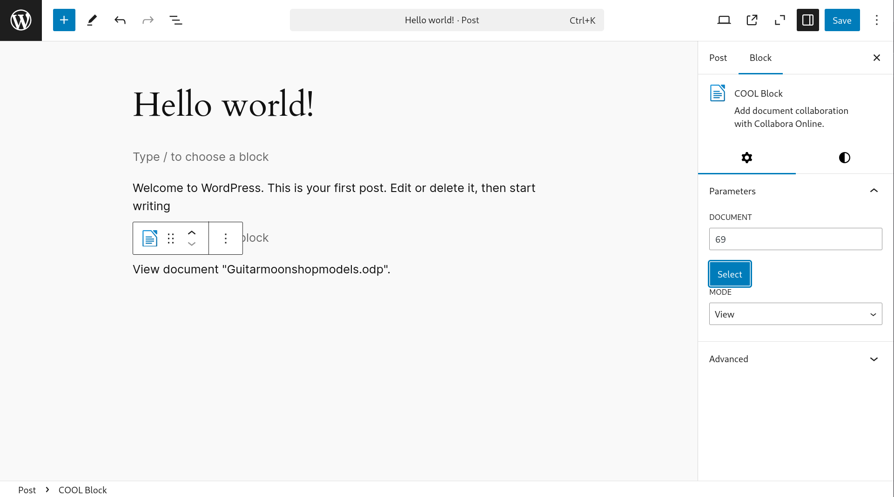

How to add a document to your WordPress™ content for collaboration with other users.

1. Upload the document through the media manager.
2. Edit the post you want it attached to. In the Gutenberg editor, just add a block.

And select the document

3. Select a mode. Possible modes are View, Review and Edit. View is a read-only mode; if the user can view the post, they can view the document. Review is a read-only mode that allow adding comments, any user with at least the role specified in the settings can review the document if they have access to the document. Edit is the fill edition mode and require to be able to edit the post the document is attached to. In any case if the user doesn’t have the proper credential they will fall back to View.

Once the post is published you can open the document. You can also use the associated permalink for a direct access. In both scenario the user will be required to login into the WordPress™ system.
