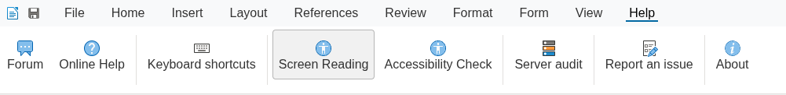
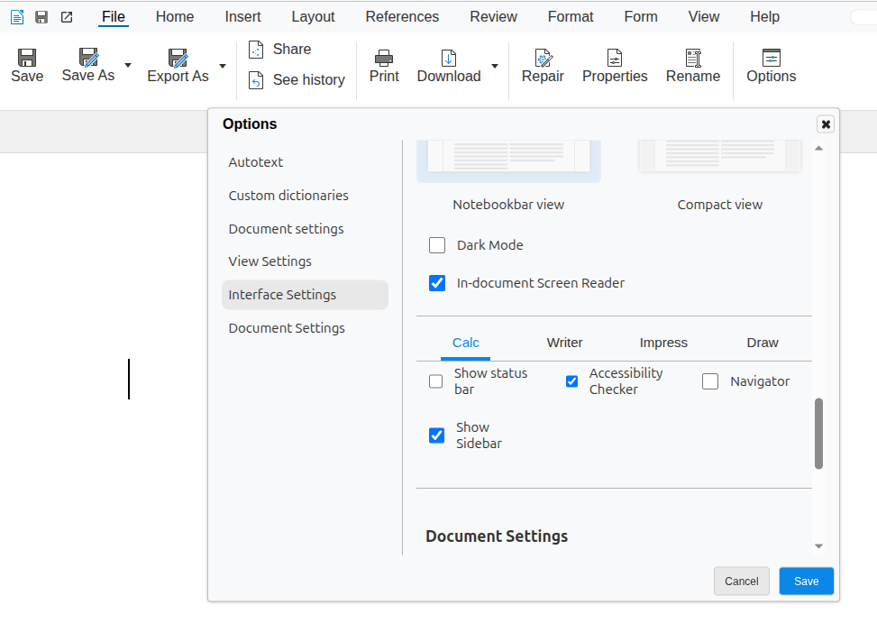

# Accessibility in Collabora Online

Enabling accessibility support has a performance impact, therefore it is off by default. You can set it `true` in `coolwsd.xml`.

accessibility block of coolwsd.xml

```
 <accessibility desc="Accessibility settings">
     <enable type="bool" desc="Controls whether accessibility support should be enabled or not." default="false">true</enable>
 </accessibility>
```

Then you will have a `Screen Reading` button in the `Help` tab that you have to press.

 

In the Nextcloud integration there is a user view setting `In-document Screen Reader` to have this button always pressed.

 

Note

The Screen Reading button only controls reading of the document content. All other UI components (such as navigator, tabs, sidebar and dialogs) remain accessible regardless of whether the button is enabled.
