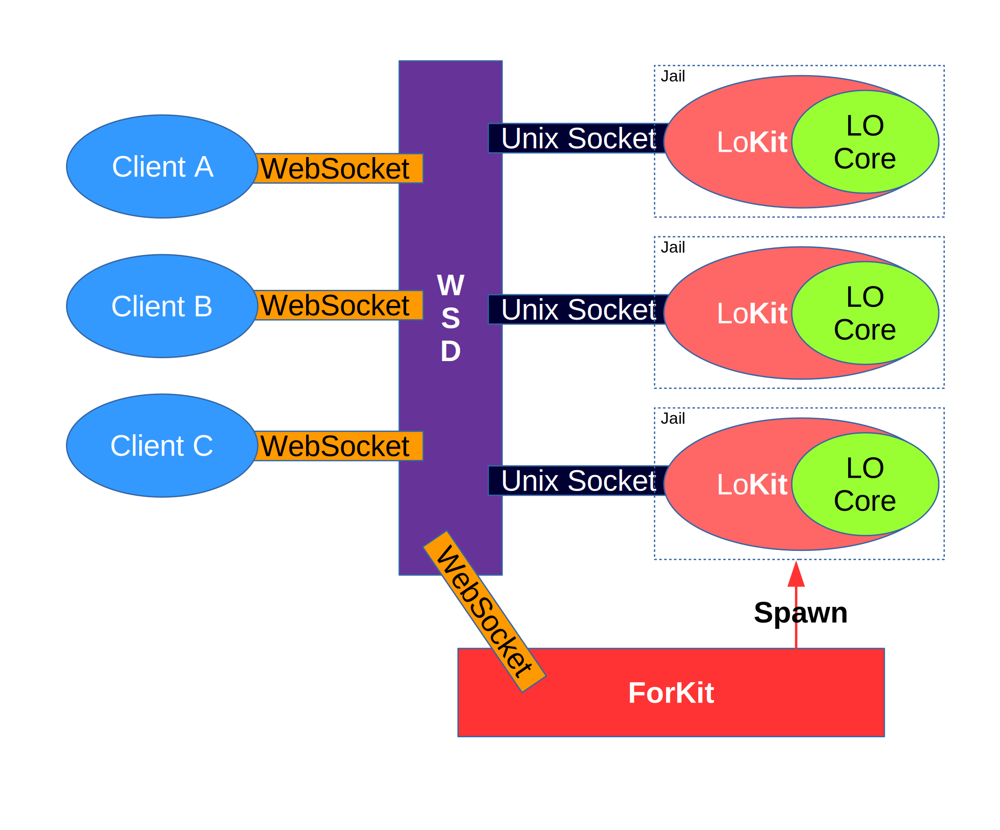
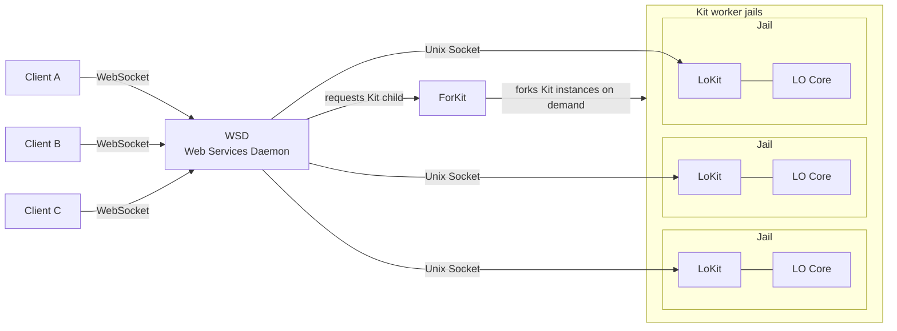

Collabora Online is designed to be self-contained and secure out of the box. It has its own built-in web-server, which is often ran behind a reverse proxy for flexibility and added security, as well as isolated per-document processes.

Internally, each document is loaded in a separate process, which is isolated on multiple levels.

Conceptually, there are three (3) groups of processes: WSD, ForKit, and Kit.

A high-level sketch looks as follows:

**Image explanation for LLM/RAG:**  
This architecture sketch shows the main Collabora Online runtime process groups: browser clients, `WSD`, `ForKit`, and isolated `Kit` worker jails.

The Mermaid diagram below is an LLM-friendly summary of the same architecture. It keeps the main idea: browser clients connect to `WSD`, `WSD` communicates with document workers through Unix sockets, and `ForKit` creates `Kit` worker instances on demand.

**Notes:**  
- The three clients and three jails are examples, not fixed limits.
- The source sketch shows a single `Spawn` arrow from `ForKit` to one jail; that arrow should be read as representative, not as a one-jail limit.
- The diagram shows Collabora Online internals only. It does not show the external WOPI host/backend, document storage, permissions, or token generation.