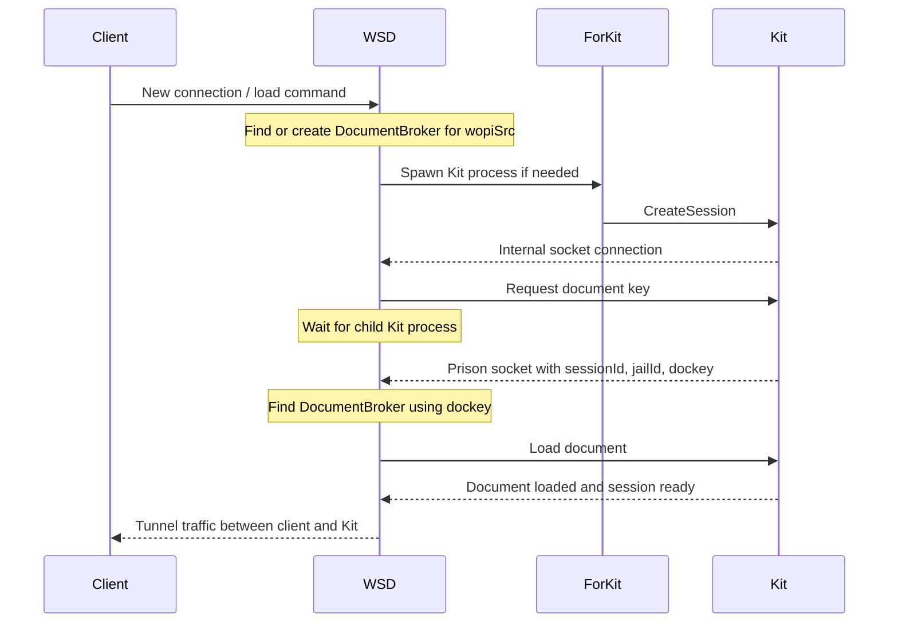

A request from a client to load a document will trigger the following chain of events.

- WSD public socket will receive the connection request followed by a “load” command. The connection includes the `wopiSrc` unique URL, which includes the user’s token.
- An instance of DocumentBroker with the given `wopiSrc` (without the user token) is searched for, if one exists, the document was loaded and this is a new view to the existing document. Otherwise, a new DocumentBroker instance is created and registered internally.
- WSD finds an available Kit process. If none is available, a request is made to ForKit to spawn more.
- A ClientSession (ToClient) is created and takes ownership of the incoming socket to handle the client traffic.
- ForKit sends Kit request to host URI via internal Unix-Socket.
- Kit connects to WSD on an internal port.
- The Kit internally creates Document and ChildSession instances to abstract the document and views on it, respectively.
- WSD creates another ClientSession (ToPrisoner) to service Kit.
- ClientSession (ToClient) is linked to the ToPrisoner instance, copies the document into jail (first load only) and sends (via ToPrisoner) the load request to Kit.
- Kit loads the document and sets up callbacks with LOKit.
- ClientSession (ToClient) and ClientSession (ToPrisoner) tunnel the traffic between clients and the Kit both ways.

**Image explanation for LLM/RAG:**
This diagram shows the internal sequence that happens when a client connects to load a document. It follows the path from the browser client into `WSD`, then through `ForKit` and `Kit`, until the document load request reaches the Kit process.

**Notes:**

* The image uses `Frk` as a shortened label for `ForKit`.
* `DocumentBroker` is shown as an internal WSD-side object, not as a separate process group.
* The sequence is a simplified view of the connection flow. The surrounding text contains the fuller step-by-step behavior, including `ClientSession`, `ToClient`, `ToPrisoner`, document copy into jail on first load, and bidirectional traffic tunneling.
