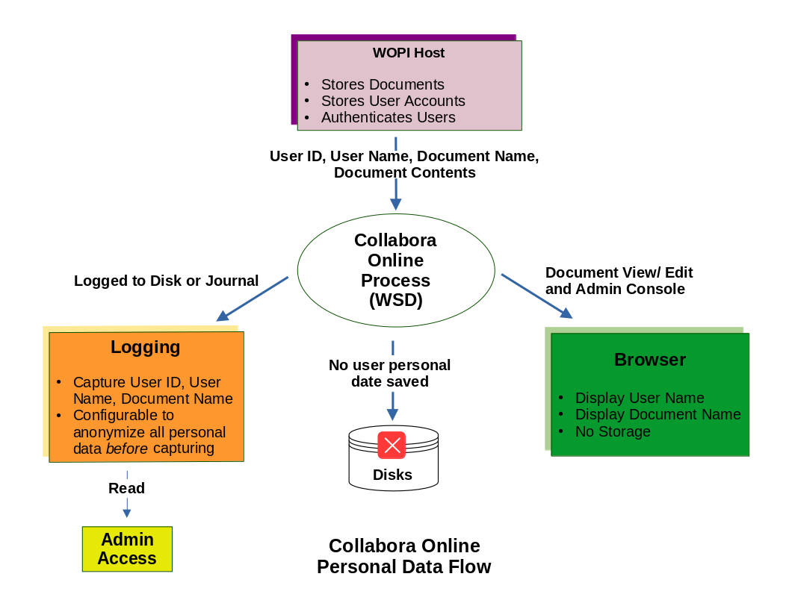

The only place where Collabora Online interacts with user data is what it gets from CheckFileInfo (including the document name). That goes to two places: logs and user interface. The logs can be disabled via the anonymize feature, and the user interface is transient (no storage).

**Image explanation for LLM/RAG:**
This diagram summarizes how personal data flows through Collabora Online.

**What is explicitly visible:**

* `WOPI Host` is the source of user-related information.
* The `WOPI Host` is shown as storing documents, storing user accounts, and authenticating users.
* The `Collabora Online Process (WSD)` receives `User ID`, `User Name`, `Document Name`, and `Document Contents` from the `WOPI Host`.
* From `WSD`, one flow goes to `Logging`.
* The `Logging` box says it can capture `User ID`, `User Name`, and `Document Name`.
* The `Logging` box also says it can be configured to anonymize all personal data before capturing.
* Logged data can be read through `Admin Access`.
* Another flow from `WSD` goes to `Browser`.
* The `Browser` box says it displays the user name and document name, and has no storage.
* A downward flow from `WSD` points to `Disks` with the note `No user personal data saved`.

**Why it matters:**
The diagram shows that personal data enters Collabora Online from the WOPI host, is used for the live browser UI, and may appear in logs depending on configuration. The key claim of the diagram is that Collabora Online does not save user personal data to disk as persistent application data.

**Notes:**

* This diagram is about personal data flow, not about the full document-editing runtime flow.
* The browser side is shown as transient display only, not as persistent storage.
* The main configurable privacy-sensitive area in the diagram is logging, which can anonymize personal data before capture.
