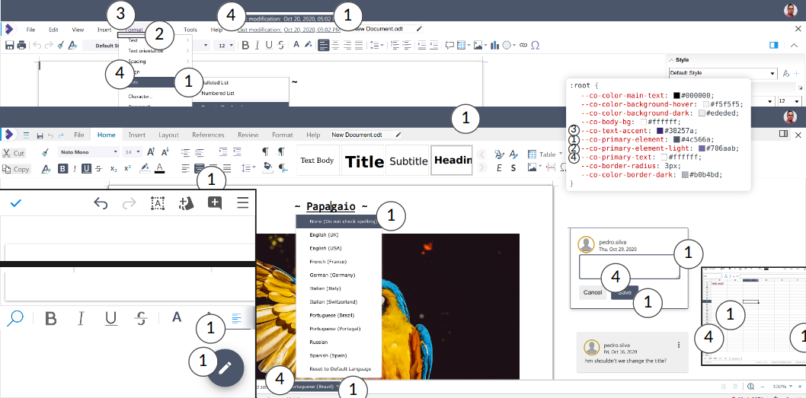
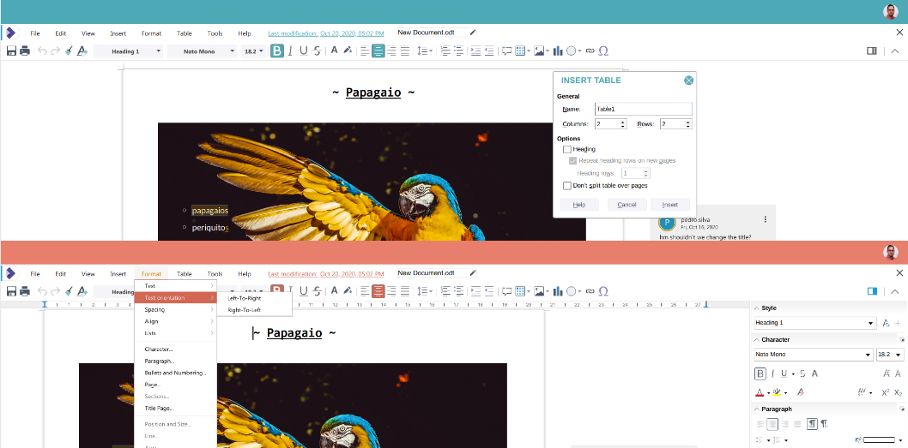

Theme it via CSS Variables

1. `--co-primary-element` is for selected elements on menus and toolbars, various bars
2. `--co-primary-element-light` is for hover and lighter accent states
3. `--co-text-accent` is the accent text colour used in branded chrome
4. `--co-primary-text` is the text on accent-coloured elements
5. `--co-border-radius` is the rounding of the selection of items on e.g. toolbars and the status bar
6. `--co-body-bg` is the background beside the document
7. `--co-color-main-text` is the fall-back in the case a specific element does not have its own colour text value

 

Tweak it and make it feel at home with your own integration
