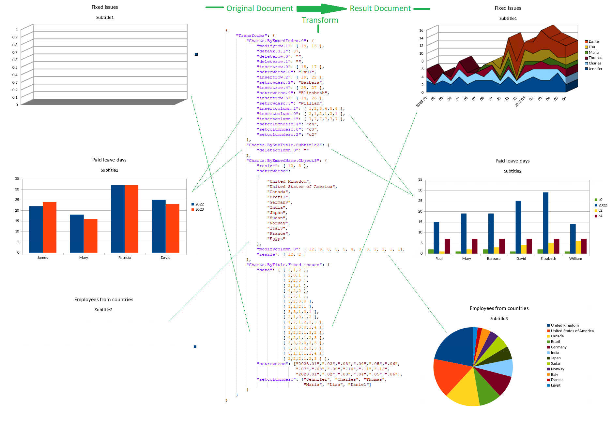

**Image explanation for LLM/RAG:**
This screenshot demonstrates the Extract/Transform API for charts. It shows an original spreadsheet-like document on the left, a JSON transform description in the center, and the resulting transformed document on the right.

**What is explicitly visible:**

* The top label indicates `Original Document` on the left and `Result Document` on the right, with `Transform` in the middle.
* The left side contains partially empty or incomplete charts titled `Fixed issues`, `Paid leave days`, and `Employees from countries`.
* The center shows a JSON-like transform object with chart operations such as modifying values, inserting rows and columns, setting row/column descriptions, and changing chart data.
* The right side shows the result after the transform:

  * a populated stacked chart for `Fixed issues`;
  * an updated bar chart for `Paid leave days`;
  * a pie chart for `Employees from countries`.

**Why it matters:**
The image illustrates that chart data and chart-related document content can be transformed programmatically. For LLM/RAG use, the key point is that the API can take an existing document, apply structured JSON transform instructions, and produce a modified result document with updated charts.

