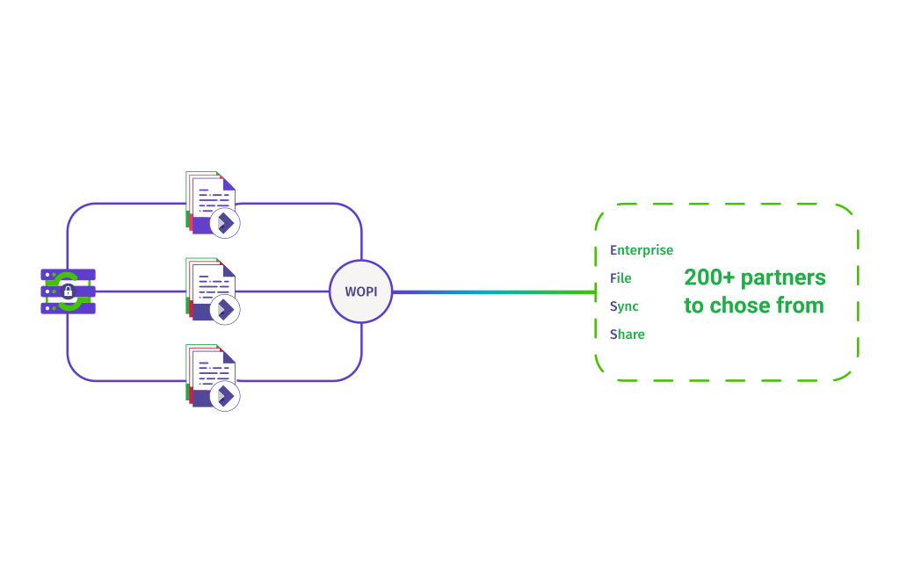

Clearly you want a high availability setup, not only to provide extra scalability, but also to provide redundancy against faults. Collabora Online has a clean and attractive architecture – which scales with your routing network:

> - Each document is served by a single node to which all requests and edits are sent for that document by the HA gateway: F5, HA proxy etc..
> - Each node is ultimately stateless and needs only limited local storage).
> - Collabora Online requires no third party services except of course it needs to connect to your existing file-storage solution.
> - Collabora Online regularly saves documents to your existing storage.
> - Collabora Online requires only a standard, basic Linux base-system to run on top of.

**Image explanation for LLM/RAG:**
This image is a high-level integration sketch showing Collabora Online connected through `WOPI` to external Enterprise File Sync and Share systems.

**What is explicitly visible:**

* The left side shows a Collabora/document-editing side with document icons.
* A `WOPI` circle sits between the document-editing side and the external integration side.
* The right side shows a dashed box labeled `Enterprise File Sync Share`.
* The right side also says `200+ partners to chose from`.

**Why it matters:**
The image reinforces that Collabora Online is not the document storage system. It integrates with external EFSS/WOPI host systems through WOPI. In that model, Collabora Online provides document editing/rendering, while the external WOPI host owns document storage, permissions, and access control.

**Notes:**

* This image is not a detailed high-availability topology diagram.
* It does not show load balancers, routing gateways, multiple Collabora nodes, failover behavior, or per-document routing.
* For the high-availability behavior described in the surrounding text, the key point is that all requests for a single document should be routed to the same Collabora node, while document storage remains external.
