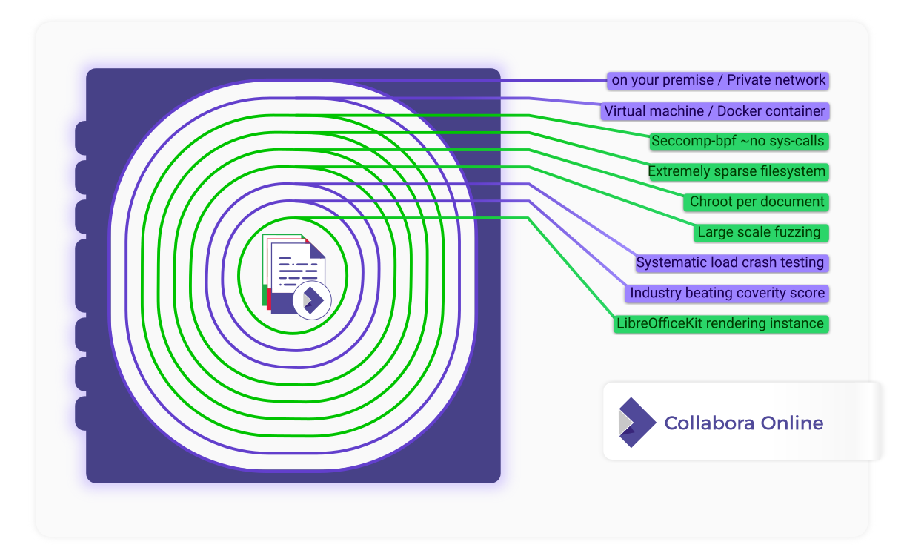
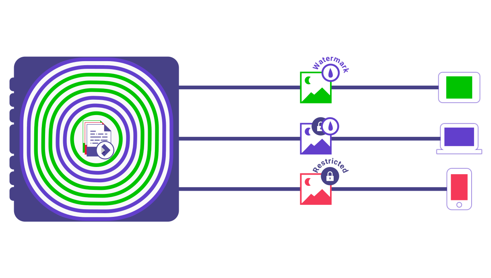

Collabora Online uses an adapted versions of the WOPI standard protocol, and we can use data stores which can provide their own policies. When your document data comes down into Collabora Online we isolate and protect your document in your on-premise server inside a series of concentric security onion shells:

Collabora keeps your document data on the server, and can send only tiled images to the client. These can also be watermarked with the viewer’s name. With granular permissions to restrict copy & paste, download, print and so on – Collabora protects your documents like no other.

